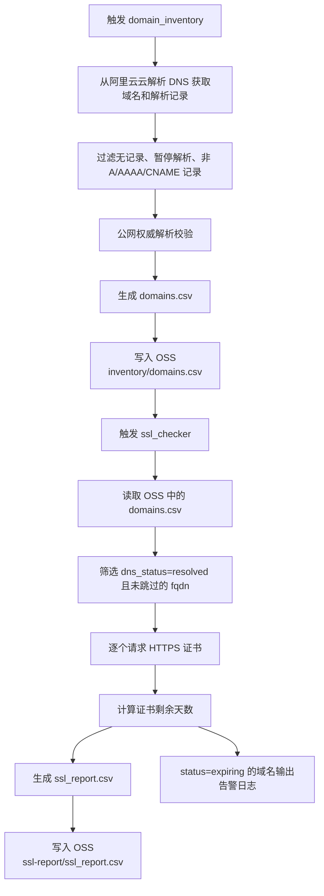

# 阿里云 FC SSL 证书巡检

这个项目把方案落成了两个可部署的阿里云函数计算函数：

- `domain_inventory`：拉取云解析 DNS 托管域名和解析记录，补做公网权威解析校验，输出 `domains.csv` 和 `summary.json` 到 OSS。
- `ssl_checker`：读取清单，对可访问 FQDN 发起 TLS 握手并判定证书是否过期/临期，输出 `ssl_report.csv` 和 `summary.json` 到 OSS。

## 简易流程图



当前默认写入固定目录，便于 OSS 触发器和第二阶段联动：

- `oss://$OSS_BUCKET/$OSS_PREFIX/inventory/domains.csv`
- `oss://$OSS_BUCKET/$OSS_PREFIX/inventory/summary.json`
- `oss://$OSS_BUCKET/$OSS_PREFIX/ssl-report/ssl_report.csv`
- `oss://$OSS_BUCKET/$OSS_PREFIX/ssl-report/summary.json`

## 目录

- `domain_inventory/index.py`
- `ssl_checker/index.py`
- `common/`
- `policies/`
- `tests/`

## 运行方式

### 阶段一 `domain_inventory`

- FC Handler：`domain_inventory.index.handler`
- 输入：可为空，当前实现按环境变量运行
- 输出：
  - `oss://$OSS_BUCKET/$OSS_PREFIX/inventory/domains.csv`
  - `oss://$OSS_BUCKET/$OSS_PREFIX/inventory/summary.json`

### 阶段二 `ssl_checker`

- FC Handler：`ssl_checker.index.handler`
- 当前实现直接读取固定的 inventory 文件，不依赖事件内容
- 输出：
  - `oss://$OSS_BUCKET/$OSS_PREFIX/ssl-report/ssl_report.csv`
  - `oss://$OSS_BUCKET/$OSS_PREFIX/ssl-report/summary.json`

## 环境变量

必填：

- `OSS_BUCKET`

建议填写：

- `OSS_PREFIX=ssl-check`
- `OSS_ENDPOINT=https://oss-cn-hangzhou.aliyuncs.com`

可选：

- `OSS_REGION=cn-hangzhou`
- `ALIDNS_REGION_ID=cn-hangzhou`
- `INVENTORY_CSV_OBJECT_KEY`
- `INVENTORY_SUMMARY_OBJECT_KEY`
- `SSL_REPORT_CSV_OBJECT_KEY`
- `SSL_REPORT_SUMMARY_OBJECT_KEY`
- `EXPIRY_THRESHOLD_DAYS=10`
- `SSL_PORT=443`
- `DNS_TIMEOUT_SEC=5`
- `TLS_TIMEOUT_SEC=8`
- `CHECK_CONCURRENCY=20`

说明：

- `OSS_ENDPOINT` 和 `OSS_REGION` 二选一即可；如果两者都没填，代码会尝试使用 `ALIBABA_CLOUD_REGION_ID` 或 `FC_REGION` 推导。
- FC 运行时不需要填写 AK/SK。请给函数绑定执行角色。
- 本地调试时可以导出：
  - `ALIBABA_CLOUD_ACCESS_KEY_ID`
  - `ALIBABA_CLOUD_ACCESS_KEY_SECRET`
  - `ALIBABA_CLOUD_SECURITY_TOKEN`（如使用 STS）

## 部署建议

### 1. 创建执行角色

信任策略使用：

- `policies/fc-execution-trust-policy.json`

权限策略参考：

- `policies/domain-inventory-role-policy.json`
- `policies/ssl-checker-role-policy.json`

如果由 RAM 用户创建或更新函数、绑定角色或配置触发器，额外给该 RAM 用户授予 `ram:PassRole`。

### 2. 部署两个函数

- Runtime：Python 3.x
- `domain_inventory`
  - Handler：`domain_inventory.index.handler`
  - 内存：`512 MB`
  - 超时：`300 s`
- `ssl_checker`
  - Handler：`ssl_checker.index.handler`
  - 内存：`1024 MB`
  - 超时：`600 s`

打包时把整个项目目录一起上传，确保 `common/` 能被导入。

### 3. 配置触发器

- 阶段一：
  - 可先手动调用
  - 后续可接 EventBridge 定时触发
- 阶段二：
  - 可手动调用
  - 或接 FC/事件总线定时触发
  - 当前代码不会读取 OSS 事件体，而是固定读取 `oss://$OSS_BUCKET/$OSS_PREFIX/inventory/domains.csv`

## CSV 字段

### `domains.csv`

- `run_id`
- `zone_domain`
- `rr`
- `fqdn`
- `record_type`
- `record_value`
- `ttl`
- `line`
- `dns_status`
- `resolved_values`
- `skip_reason`
- `collected_at`

规则：

- 只纳入 `A`、`AAAA`、`CNAME`
- `@` 会转换为根域名
- `*` 会输出为跳过记录，`skip_reason=wildcard_record`
- 只有 `dns_status=resolved` 且 `skip_reason` 为空的主机才会进入证书检查

### `ssl_report.csv`

- `run_id`
- `fqdn`
- `port`
- `status`
- `days_remaining`
- `threshold_days`
- `not_after_utc`
- `issuer`
- `subject_cn`
- `san_count`
- `error_message`
- `checked_at`

状态含义：

- `ok`
- `expiring`
- `expired`
- `error`

## 本地测试

安装依赖：

```bash
python3 -m pip install -r requirements-dev.txt
```

运行测试：

```bash
python3 -m pytest
```

## FC 打包注意事项

不能直接在 macOS 上把本机依赖装进 zip 再上传到 FC。函数计算运行在 Linux 上，如果包里混入 Darwin 的 `.so`，会报 `invalid ELF header`。

项目里的打包脚本 [build_fc_packages.sh](./build_fc_packages.sh) 已经改成按 Linux 目标平台下载 wheel：

```bash
./build_fc_packages.sh
```

默认目标是：

- `FC_TARGET_PLATFORM=manylinux2014_x86_64`
- `FC_TARGET_PYTHON=310`

如果你的 FC Runtime 不是 Python 3.10，可以在打包时改成对应版本，例如 Python 3.9：

```bash
FC_TARGET_PYTHON=39 ./build_fc_packages.sh
```

## 已实现的关键行为

- 阿里云 DNS 托管域分页拉取
- 解析记录分页拉取
- 记录数为 0 的主域跳过
- 仅检查 `A/AAAA/CNAME`
- 权威 NS 查询前先把 NS 主机名解析成 IP
- 阶段二支持 OSS 事件触发和手动指定 `inventory_key`
- 同一 FQDN 去重后再做 TLS 检查
- 证书链校验失败、自签、握手失败、超时统一落 `error`

## 注意事项

- 如果 FC 绑定了 VPC，请确认仍有公网出网能力，否则阶段一无法访问权威 NS，阶段二无法连接公网 `443`。
- 当前实现只检查 `443/HTTPS`。
- 当前实现不会主动发告警，只负责把巡检结果写入 OSS。
- 固定目录模式下，新执行会覆盖上一次的 CSV/summary 文件，但 CSV 内仍保留本次执行的 `run_id`。

## 模板化部署（新增）

仓库已提供完整模板化部署目录：`deploy/`

核心文件：

- 参数模板：`deploy/templates/vars.env.tpl`
- FC/SLS/告警模板：`deploy/templates/`
- 渲染脚本：`deploy/render_templates.sh`
- CLI 部署脚本：`deploy/deploy_cli.sh`
- 详细说明：`deploy/README.md`

快速开始：

```bash
cp deploy/templates/vars.env.tpl deploy/vars.env
source deploy/vars.env
./deploy/render_templates.sh
./deploy/deploy_cli.sh all
```
